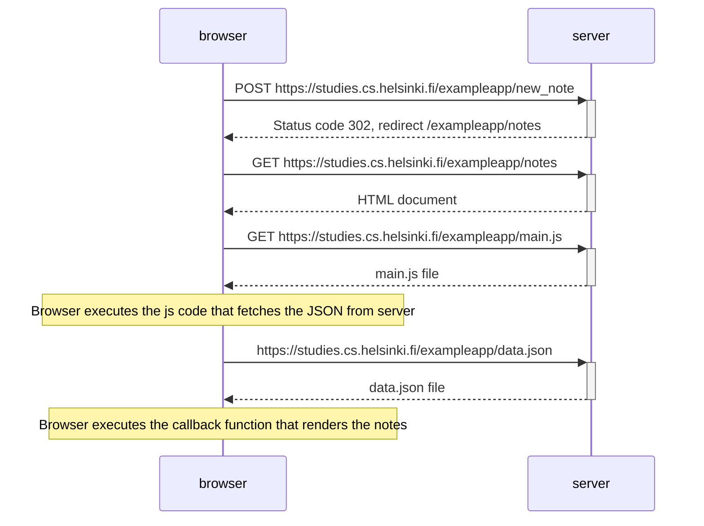

```mermaid
sequenceDiagram
participant browser
participant server

browser->>+server: POST https://studies.cs.helsinki.fi/exampleapp/new_note
server-->>-browser: Status code 302, redirect /exampleapp/notes

browser->>+server: GET https://studies.cs.helsinki.fi/exampleapp/notes
server-->>-browser: HTML document

browser->>+server: GET https://studies.cs.helsinki.fi/exampleapp/main.js
server-->>-browser: main.js file

Note over browser: Browser executes the js code that fetches the JSON from server

browser->>+server: https://studies.cs.helsinki.fi/exampleapp/data.json
server-->>-browser: data.json file

Note over browser: Browser executes the callback function that renders the notes
```